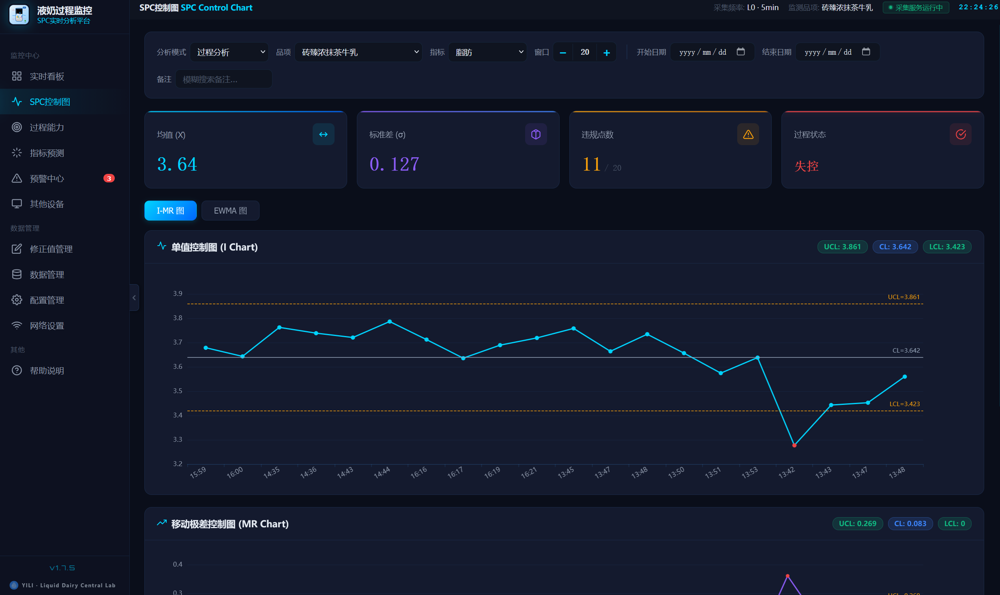

# spc-monitor — 液奶过程监控平台

基于 FT120 仪器的乳制品生产过程 SPC 监控、预测预警与数据分析桌面平台。

<p align="center">
  
</p>

## 核心功能

### SPC 过程监控
- **I-MR 控制图**：单值移动极差图，8 条 Nelson 判异规则自动检测
- **EWMA 控制图**：指数加权移动平均，λ 滑块调参（0.05~0.5），检测微小偏移
- **过程能力分析**：Cp/Cpk/Pp/Ppk 指数，滑动窗口 Cpk 趋势，自适应窗口计算
- **过程状态判定**：失控 / 基本受控 / 受控三级状态，基于最近 10 个数据点

### 预测与风险评估
- **自动模型选择**：ADF 平稳性检验 → 双拟合 d=0/d=1 → ETS vs ARIMA 自动择优
- **Mann-Kendall 趋势检验**：非参数趋势检验 + Sen 斜率估计
- **越限概率计算**：基于预测分布的概率法，四级风险等级（LOW / MEDIUM / HIGH / CRITICAL）
- **CUSUM 漂移检测**：分段 CUSUM，支持换料 / 换罐标记
- **交叉指标预测**：源指标 → 目标指标的实时预测框架（如脂肪 → 饱和脂肪）
- **GBDT 特征重要性**：GradientBoosting 回归 + 特征排序

### 数据采集与连接
- **多数据源**：SQL Server、MDB 文件、FTA 数据源
- **自适应调度**：自动降级采集频率，端口占用自动清理
- **WebSocket 推送**：心跳机制保活，断线自动重连
- **数据预览**：MDB 样本边界截断，中文编码自动处理

### 预警系统
- **多级告警**：Nelson 规则违规、Cpk 偏低、越限风险
- **交叉预测告警**：源指标触发时自动生成目标指标预警
- **通知方式**：应用内 Toast + 系统原生通知 + 声音提醒
- **告警中心**：按品项 / 指标筛选，支持日期范围过滤

### 桌面应用
- **Tauri v2 桌面壳**：Rust 启动器，开机自启，单实例模式
- **系统托盘**：最小化到托盘，双击恢复窗口
- **科学主题启动页**：动态状态、进度条、连接步骤指示
- **看板小组件**：悬浮窗实时轮播 SPC 数据

## 技术栈

| 层 | 技术 |
|---|---|
| 前端 | React 18 + TypeScript + ECharts 5 + Vite 5 |
| 后端 | FastAPI + Uvicorn + SQLite |
| 分析 | NumPy + SciPy + statsmodels + scikit-learn |
| 桌面 | Rust + Tauri v2 + Nuitka 打包 |

## 项目结构

```
spc-monitor/
├── backend/           # FastAPI 后端
│   ├── app/
│   │   ├── api/       # API 路由
│   │   ├── core/      # 配置与认证
│   │   ├── engine/    # SPC / 预测 / 过程能力引擎
│   │   └── services/  # 数据采集与存储
│   └── main.py
├── frontend/          # React 前端
│   └── src/
│       ├── pages/     # 仪表盘、SPC、预测、告警、帮助
│       ├── components/
│       └── services/  # API 与 WebSocket 客户端
├── launcher/          # Tauri v2 桌面启动器
├── scripts/           # 一键启动脚本
└── docs/              # 用户文档
```

## 快速开始

### 环境要求

- Python 3.11+
- Node.js 18+
- Rust 1.70+（仅桌面启动器）

### 开发模式

```bash
# 后端
cd backend && pip install -r requirements.txt && python main.py

# 前端
cd frontend && npm install && npm run dev

# 桌面启动器
cd launcher && cargo tauri dev
```

### 生产打包

```bash
# Windows 一键打包
build.bat      # Nuitka 编译后端 + Tauri 打包桌面应用
package.ps1    # NSIS 安装包生成
```

## API 文档

启动后端后访问：http://localhost:18080/docs

## 许可证

[Apache License 2.0](LICENSE)
